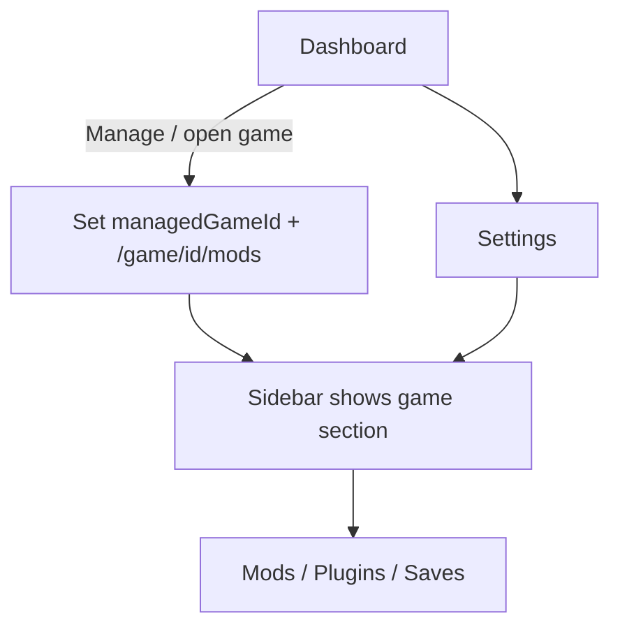

# Module: Managed game context (Vortex-style)

## Purpose

Describe how Pantheon tracks a **single managed game** for global UI (sidebar sections, mods/plugins/saves scoped to that game), persistence across app restarts, and URL structure.

## Definitions

| Term | Meaning |
|------|---------|
| **Library** | All games registered in the database; the dashboard (`/`) lists them. |
| **Managed game** | The game currently selected for tooling: `managedGameId` in the global game store. Drives game-specific sidebar links and nested routes under `/game/:id/*`. |
| **Manage** | User action that sets `managedGameId` and navigates to `/game/:id/mods` (default game scope view). |

## State: `managedGameId`

- Stored in the Solid.js game store (`entities/game`).
- **Persisted** in `localStorage` under key `pantheon.managedGameId`.
- **Validation**: After `loadGames()`, if `managedGameId` is not in the loaded `games` array, clear it.
- **Clear** when the managed game is removed from the library (`remove_game_from_library`).
- Navigating to any `/game/:id/...` route **sets** `managedGameId` to `id` (layout syncs URL and store).

Visiting global routes (e.g. `/`, `/settings`) does **not** clear `managedGameId` (same idea as Vortex keeping the active game while browsing settings).

## Routes

| Path | Purpose |
|------|---------|
| `/` | Game library (dashboard). |
| `/game/:id` | Redirects to `/game/:id/mods`. |
| `/game/:id/mods` | Mods installed for this game (catalog + install/toggle). |
| `/game/:id/plugins` | Game plugins list (MVP: scan plugin-capable data folder). |
| `/game/:id/saves` | Save files list when `list_game_saves` knows the folder (MVP: `game_id` → Documents/My Games/.../Saves). Hidden in the sidebar if unsupported (`gameSupportsKnownSavesLocation`). |
| `/mods` | Not linked from the global sidebar. If opened directly: when `managedGameId` is set → redirect to `/game/:managedGameId/mods`; else empty state prompting to manage a game from the library. |
| `/deployments`, `/settings` | Global areas; always linked from the general sidebar block. |

## Sidebar layout

The sidebar (`src/widgets/Sidebar/`) is a column: **top area** → **scrollable nav** → **footer**.

### General block (always)

- Section label (i18n: “General” / «Общее»).
- Links: **Games** (`/`), **Deployments** (`/deployments`), **Settings** (`/settings`).
- **There is no global “Mods” item** — mod management is only under the managed game (see below).

### Header: brand vs game banner

- **No managed game**: shows Pantheon branding (icon + wordmark) in the top area.
- **Managed game set** (`managedGameId` resolves to a row in `games[]`): the top area is a **game banner** (Vortex-inspired):
  - Background: Steam library header image when `launcher === 'steam'` and `details.steamAppId` is set (`steamHeaderImageUrl` in `shared/lib/steam-art.ts`), else `details.logo` if present, else a letter placeholder from the game name.
  - Dark gradient overlay for text contrast.
  - Title: game name (hidden when the sidebar is collapsed).
  - **Launch**: circular **Play** control (SVG triangle) on the right; calls `launchGame(game)` from `shared/lib/launch-game.ts` (Steam URL or first `requiredFiles` exe). Disabled when `installPathMissing === true`.

### Game navigation block

- Visible only when `managedGameId` matches a game in `games`.
- Section title: game **name** (duplicate label for clarity; the banner above already identifies the game).
- Links: **Mods** → `/game/:id/mods` always for the managed game.
- **Saves** → `/game/:id/saves` only when Pantheon knows a save directory for that catalog `game.id` (see `saves_dir_for_game_id` / `list_game_saves`). In code: `gameSupportsKnownSavesLocation(game)` (`gameSaves` in `supportedModTypes` or legacy ids).
- **Plugins** → `/game/:id/plugins` only when the title supports Gamebryo-style plugins (`.esp` / `.esm` / `.esl` in `Data`), same idea as Vortex’s Plugins tab (extension `gamebryo-plugin-management`). In code: `gameSupportsGamebryoPlugins(game)` in `shared/lib/game-support.ts` (`modPlugin` in `supportedModTypes` or legacy catalog ids).
- Active state derives from `useLocation().pathname`.

### Collapse control

- The **collapse / expand** toggle is pinned to the **bottom** of the sidebar (`sidebar-footer`), not next to the logo, so the header stays dedicated to branding or the game banner.

### Styling

- Component styles: `src/widgets/Sidebar/Sidebar.css` (banner, play button, footer, nav sections).

Out of scope for MVP (future): Nexus browse, collections, downloads row matching Vortex’s full GENERAL list.

## Code map (frontend)

| Area | Location |
|------|----------|
| `managedGameId`, persist, validation | `src/entities/game/model/gameStore.ts`, `src/shared/lib/managed-game-storage.ts` |
| Nested `/game/:id/*` routes | `src/app/router/index.tsx`, `src/pages/game-scope/` |
| Sidebar UI (banner, nav, footer toggle) | `src/widgets/Sidebar/index.tsx`, `src/widgets/Sidebar/Sidebar.css` |
| Launch from UI | `src/shared/lib/launch-game.ts` |
| Game mods / plugins / saves pages | `src/pages/game-mods/`, `src/pages/game-plugins/`, `src/pages/game-saves/` |
| Dashboard “Manage” | `src/pages/dashboard/index.tsx` |

## Backend (Tauri)

- `list_game_plugins(game_id)` — resolves install/support paths from DB; lists `.esp` / `.esm` / `.esl` in the game’s data folder (see `support_path` for Gamebryo titles).
- `list_game_saves(game_id)` — resolves save directory per known `game_id` on Windows (`USERPROFILE/Documents/My Games/...`); returns file names (or paths) for MVP.

See [API_REFERENCE.md](../API_REFERENCE.md) for exact signatures once implemented.

## Flow (summary)

## Related

- [ui-structure.md](./ui-structure.md) — FSD and layout.
- [load-order-manager.md](./load-order-manager.md) — Full load order (later than MVP plugin list).
